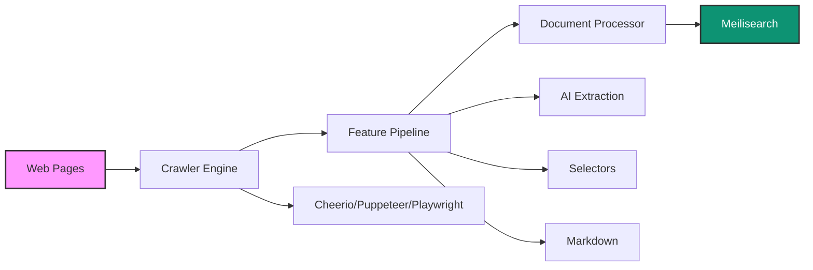

## Transform Websites into Searchable Knowledge

Scrapix is a powerful, production-ready web scraping platform that intelligently crawls websites and indexes content directly into Meilisearch. Built with TypeScript and powered by AI, it handles everything from simple static sites to complex SPAs.

<CardGroup cols={3}>
  <Card
    title="Intelligent Crawling"
    icon="brain"
    color="#0D9373"
  >
    AI-powered content extraction with GPT models for structured data and summaries
  </Card>
  <Card
    title="Multiple Strategies"
    icon="layer-group"
    color="#07C983"
  >
    Choose from Cheerio, Puppeteer, or Playwright based on your site's needs
  </Card>
  <Card
    title="Production Ready"
    icon="rocket"
    color="#0D9373"
  >
    Battle-tested with rate limiting, retry logic, and distributed job queues
  </Card>
</CardGroup>

## Key Features

<Tabs>
  <Tab title="🎯 Core Features">
    <AccordionGroup>
      <Accordion title="Multiple Crawler Strategies" icon="spider">
        - **Cheerio**: Lightning-fast static HTML parsing
        - **Puppeteer**: Chrome automation for JavaScript-heavy sites
        - **Playwright**: Cross-browser support with advanced capabilities
      </Accordion>
      
      <Accordion title="AI-Powered Extraction" icon="wand-magic-sparkles">
        - Custom extraction prompts with OpenAI GPT models
        - Automatic content summarization
        - Structured data extraction from unstructured content
      </Accordion>
      
      <Accordion title="Smart Document Processing" icon="file-lines">
        - Automatic text chunking for large documents
        - Markdown conversion for clean indexing
        - Custom CSS selectors for precise extraction
      </Accordion>
      
      <Accordion title="Enterprise Features" icon="building">
        - Distributed job queue with Redis
        - Webhook notifications for job status
        - Rate limiting and retry mechanisms
        - Proxy support for IP rotation
      </Accordion>
    </AccordionGroup>
  </Tab>
  
  <Tab title="⚡ Performance">
    - **Concurrent crawling** with configurable parallelism
    - **Batch processing** for efficient Meilisearch indexing
    - **Memory-efficient** streaming for large sites
    - **Smart caching** to avoid redundant requests
    - **Automatic retries** with exponential backoff
  </Tab>
  
  <Tab title="🔧 Flexibility">
    - **CLI tool** for quick one-off crawls
    - **REST API** for integration into your stack
    - **Docker support** for containerized deployments
    - **Programmatic API** for custom implementations
    - **Extensible architecture** with custom features
  </Tab>
</Tabs>

## Use Cases

<CardGroup cols={2}>
  <Card
    title="Documentation Sites"
    icon="book"
    href="/examples/documentation-site"
  >
    Index technical documentation with code highlighting and structured navigation
  </Card>
  <Card
    title="E-commerce Catalogs"
    icon="shopping-cart"
    href="/examples/ecommerce"
  >
    Extract product data with prices, descriptions, and specifications
  </Card>
  <Card
    title="News Aggregation"
    icon="newspaper"
    href="/examples/news-aggregator"
  >
    Crawl news sites and blogs with automatic summarization
  </Card>
  <Card
    title="Knowledge Bases"
    icon="database"
    href="/examples/spa-application"
  >
    Index SPAs and dynamic content with JavaScript rendering
  </Card>
</CardGroup>

## Quick Comparison

<Table>
  <thead>
    <tr>
      <th>Feature</th>
      <th>Scrapix</th>
      <th>Traditional Scrapers</th>
    </tr>
  </thead>
  <tbody>
    <tr>
      <td>Meilisearch Integration</td>
      <td>✅ Native</td>
      <td>❌ Manual</td>
    </tr>
    <tr>
      <td>AI Extraction</td>
      <td>✅ Built-in</td>
      <td>❌ Custom code</td>
    </tr>
    <tr>
      <td>Multiple Strategies</td>
      <td>✅ 3 engines</td>
      <td>⚠️ Usually 1</td>
    </tr>
    <tr>
      <td>Job Queue</td>
      <td>✅ Redis/Bull</td>
      <td>❌ DIY</td>
    </tr>
    <tr>
      <td>Production Ready</td>
      <td>✅ Yes</td>
      <td>⚠️ Varies</td>
    </tr>
    <tr>
      <td>TypeScript</td>
      <td>✅ Full support</td>
      <td>⚠️ Varies</td>
    </tr>
  </tbody>
</Table>

## Architecture Overview



## Getting Started

<Steps>
  <Step title="Install Scrapix">
    ```bash
    npm install -g @scrapix/cli
    ```
  </Step>
  
  <Step title="Set up Meilisearch">
    ```bash
    docker run -p 7700:7700 getmeili/meilisearch:latest
    ```
  </Step>
  
  <Step title="Run your first crawl">
    ```bash
    scrapix crawl -c '{"start_urls":["https://example.com"]}'
    ```
  </Step>
</Steps>

<Info>
  **Ready to dive in?** Check out our [Quickstart Guide](/quickstart) to get up and running in 5 minutes.
</Info>

## Community & Support

<CardGroup cols={4}>
  <Card
    title="Discord"
    icon="discord"
    href="https://discord.meilisearch.com"
  >
    Join our community
  </Card>
  <Card
    title="GitHub"
    icon="github"
    href="https://github.com/meilisearch/scrapix"
  >
    Star & contribute
  </Card>
  <Card
    title="Documentation"
    icon="book"
    href="https://docs.meilisearch.com"
  >
    Meilisearch docs
  </Card>
  <Card
    title="Blog"
    icon="rss"
    href="https://blog.meilisearch.com"
  >
    Latest updates
  </Card>
</CardGroup>

<Note>
  **Built by Meilisearch** - The team behind the lightning-fast, open-source search engine that developers love.
</Note>